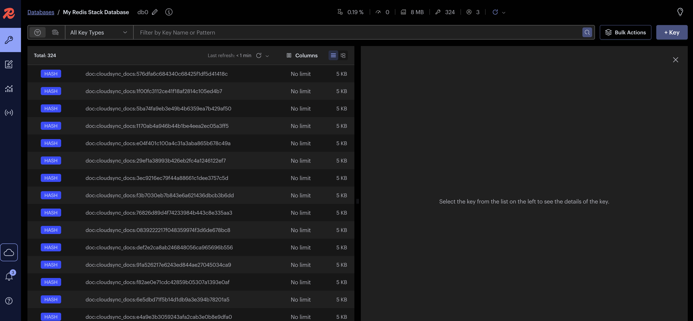
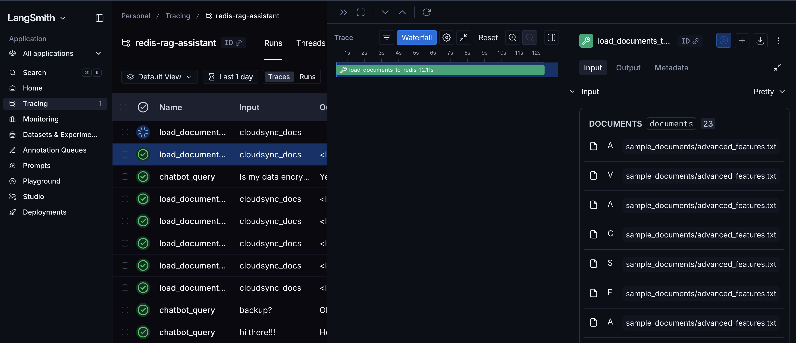
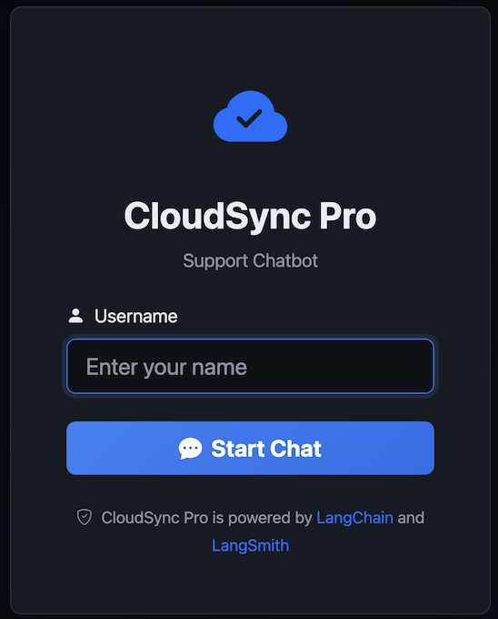
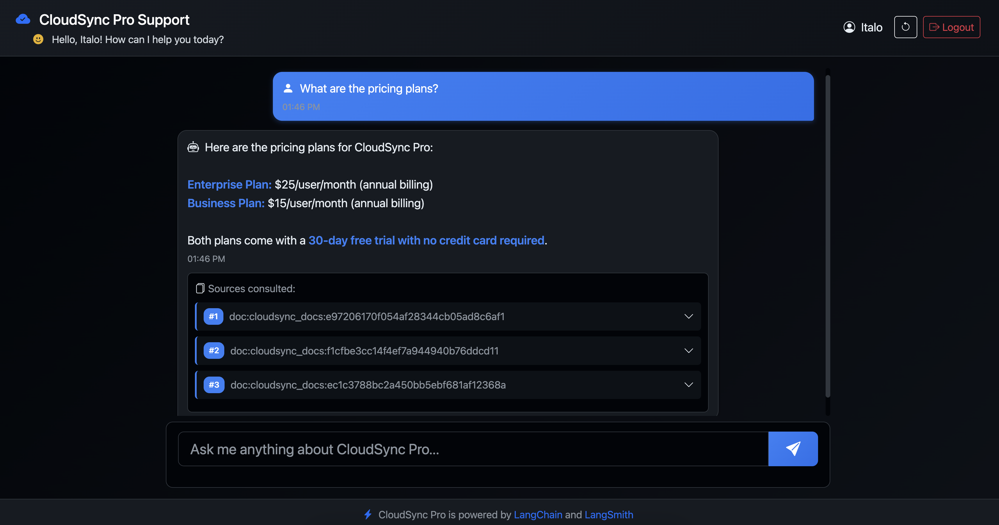
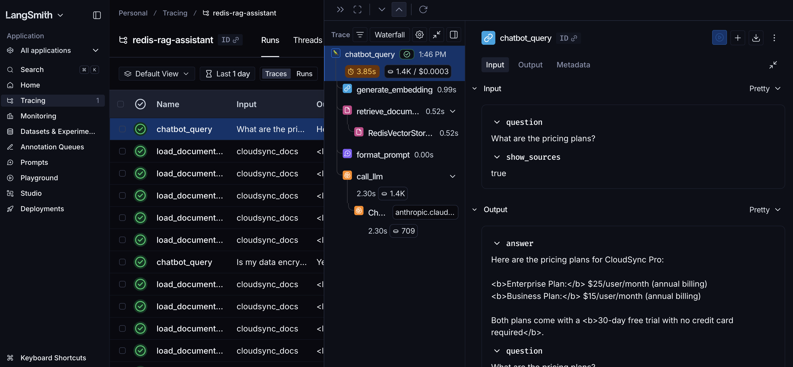
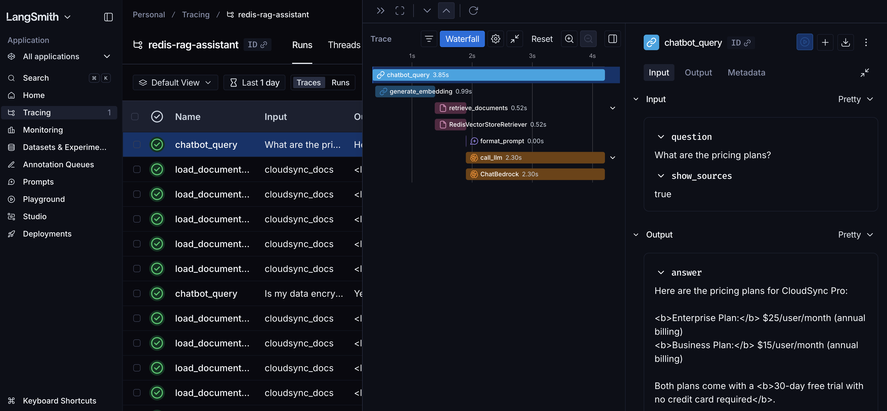

# CloudSync Pro Support Chatbot

A production-ready RAG (Retrieval-Augmented Generation) chatbot with a modern web interface, demonstrating **LangSmith capabilities** for prompt engineering, testing, and monitoring.

## ✨ Features

- 🌐 **Modern Web Interface** - Flask-based web app with dark mode UI
- 🔐 **Session Management** - Multi-user support with isolated chat sessions
- 🤖 **AWS Bedrock Integration** - Claude Haiku for chat, Titan for embeddings
- 🔍 **Redis Vector Store** - Fast semantic search with vector embeddings
- 📊 **LangSmith Monitoring** - Complete observability of all RAG operations
- 💬 **Conversation Memory** - Context-aware responses with chat history
- 📚 **Source Citations** - Expandable source documents for transparency
- 🎨 **Responsive Design** - Beautiful UI works on desktop and mobile

## 🎯 What This Demonstrates

This project showcases how LangSmith helps with:

### 1. **Prompt Engineering**
- Track different prompt variations
- Compare performance across prompt templates
- Optimize retrieval and generation prompts separately

### 2. **Testing**
- Evaluate RAG quality with keyword coverage
- Track test results over time in LangSmith

### 3. **Monitoring**
- Real-time trace visualization for all queries
- Track retrieval quality and LLM responses
- Monitor latency, token usage, and errors
- Conversation history tracking with windowing

## 🏗️ Architecture

```
User (Web Browser)
    ↓
[Flask Web App] → handles sessions, routing
    ↓
[RAG Chatbot Class] → orchestrates RAG pipeline
    ↓
[VectorStoreUtils] → shared embedding and Redis utilities
    ↓
[AWS Bedrock Titan Embeddings] → converts query to vector (1024 dims)
    ↓
[Redis Vector Store] → semantic search for relevant docs
    ↓
[Retrieved Context] + [User Query] + [Chat History] + [Prompt Template]
    ↓
[AWS Bedrock - Claude Haiku] → generates answer
    ↓
[Flask API] → returns JSON response
    ↓
[Web UI] → displays answer with expandable sources

(All steps traced in LangSmith for observability)
```

## 🛠️ Technology Stack

- **Backend**: Python 3.9+, Flask 3.1
- **LLM**: AWS Bedrock (Claude Haiku, Titan Embeddings v2)
- **Vector Store**: Redis with RedisInsight
- **Framework**: LangChain
- **Monitoring**: LangSmith
- **Frontend**: Bootstrap 5.3, jQuery, Bootstrap Icons
- **Deployment**: Docker Compose

## 📋 Prerequisites

- Python 3.9+ (tested on Python 3.14)
- Docker & Docker Compose
- AWS Account with Bedrock access in Frankfurt (eu-central-1), or any other region of your choice
- LangSmith account (free tier works)

## ⚠️ Important Notes

- **Redis Package Version**: This project uses `redis==4.6.0` instead of the latest version (7.x) due to compatibility requirements with `langchain_community.vectorstores.redis`. Do not upgrade to redis 7.x.
- **Python 3.14**: While the project works on Python 3.14, you may see warnings about Pydantic V1 compatibility. These warnings can be safely ignored.
- **Deprecation Warning**: You may see a deprecation warning for the Redis vector store class. This is expected and will be addressed when `langchain-redis` supports Python 3.14.

## 🚀 Quick Start

### 1. Clone and Setup

```bash
# Create virtual environment
python3 -m venv .venv
source .venv/bin/activate  # On Windows: .venv\Scripts\activate

# Install dependencies
pip install --upgrade pip
pip install -r requirements.txt
```

### 2. Configure Environment Variables

Create a `.env` file with your credentials:

```bash
#!/bin/bash

# LangSmith Configuration
export LANGSMITH_TRACING=true
export LANGSMITH_ENDPOINT=https://eu.api.smith.langchain.com
export LANGSMITH_API_KEY="your_api_key_here"
export LANGSMITH_PROJECT="redis-rag-assistant"

# AWS Bedrock Configuration
export AWS_ACCESS_KEY_ID="your_access_key"
export AWS_SECRET_ACCESS_KEY="your_secret_key"
export AWS_REGION=eu-central-1  # Frankfurt

# Redis Configuration
export REDIS_HOST=localhost
export REDIS_PORT=6379
export REDIS_PASSWORD=

# Flask Configuration
export FLASK_SECRET_KEY="your_secret_key"
export FLASK_PORT=8888
export FLASK_DEBUG=True
```

### 3. Configure AWS IAM Permissions

Your AWS user/role needs the following IAM permissions to use Bedrock:

#### Required IAM Policy

Create an IAM policy with these permissions:

```json
{
    "Version": "2012-10-17",
    "Statement": [
        {
            "Sid": "BedrockInvokeModel",
            "Effect": "Allow",
            "Action": [
                "bedrock:InvokeModel",
                "bedrock:InvokeModelWithResponseStream"
            ],
            "Resource": [
                "arn:aws:bedrock:eu-central-1::foundation-model/anthropic.claude-3-haiku-20240307-v1:0",
                "arn:aws:bedrock:eu-central-1::foundation-model/anthropic.claude-3-5-sonnet-20241022-v2:0",
                "arn:aws:bedrock:eu-central-1::foundation-model/anthropic.claude-3-opus-20240229-v1:0",
                "arn:aws:bedrock:eu-central-1::foundation-model/amazon.titan-embed-text-v2:0",
                "arn:aws:bedrock:eu-central-1::foundation-model/amazon.titan-embed-text-v1"
            ]
        }
    ]
}
```

#### Steps to Apply:

1. **AWS Console** → **IAM** → **Policies** → **Create policy**
2. Use JSON editor and paste the policy above
3. Name it: `BedrockRAGChatbotPolicy`
4. **IAM** → **Users** → Select your user → **Add permissions** → Attach the policy

#### Enable Model Access

Before using Bedrock models, you must request access:

1. **AWS Console** → **Amazon Bedrock** → **Model access** (left sidebar)
2. Click **Manage model access** or **Request model access**
3. Select these models:
   - ✅ **Claude 3 Haiku** (for chat responses)
   - ✅ **Titan Text Embeddings V2** (for document embeddings)
   - ✅ **Claude 3.5 Sonnet** (optional, for better responses)
4. Click **Save changes** and wait for approval (usually instant for Titan, may take 1-2 minutes for Claude)

**Note**: Model access must be requested per AWS region. Ensure you're in **eu-central-1 (Frankfurt)**.

### 4. Start Redis

```bash
docker-compose up -d
```

Verify Redis is running:
```bash
docker ps
```

You should see `redis-vectordb` container running.

**Optional:** Access RedisInsight UI at http://localhost:8001

### 5. Load Documents

```bash
python load_documents.py
```

This will:
- Read all `.txt` files from `sample_documents/`
- Split them into chunks (500 chars, 50 overlap)
- Create embeddings using **AWS Bedrock Titan Embeddings v2**
- Store vectors in Redis

Sample documents included:
- `product_info.txt` - CloudSync Pro features and pricing
- `faq.txt` - Frequently asked questions
- `troubleshooting.txt` - Common issues and solutions
- `getting_started.txt` - Onboarding guide for new users
- `advanced_features.txt` - Power user features


Documents loaded into Redis as vectors


LangSmith Tracing


### 6. Run the Web Application

```bash
python app.py
```

Then open your browser to: **http://localhost:8888**

Features:
- Login with any username (no password required)
- Interactive chat interface with dark mode
- Quick question buttons for common queries
- Expandable source citations (click to view full content)
- Conversation reset functionality
- Real-time message updates via AJAX


Login page


Chatbot


LangSmith Tracing


LangSmith Tracing (Waterfall view)


### 7. Run the CLI Chatbot (Alternative)

```bash
python chatbot.py
```

Interactive terminal-based chatbot for testing and development.

## 📊 Using LangSmith for Monitoring

### Prompt Engineering

1. **Try different prompts:**
   - Edit the prompt template in `chatbot.py`
   - Run the chatbot and compare responses
   - View trace comparisons in LangSmith

2. **Key metrics to monitor:**
   - Retrieval relevance (check source documents)
   - Response quality
   - Token usage
   - Latency per component

### Live Monitoring

1. **Chat with the bot** (generates live traces)

2. **In LangSmith, demonstrate:**
   - Real-time trace visualization
   - See the full RAG pipeline: Embedding → Retrieval → Generation
   - Filter by tags: `rag`, `chatbot`, `embedding`, `retrieval`
   - Search for specific queries
   - Identify slow or failing queries
   - Track conversation flows with memory

## 🔍 Key Files

### Backend
- `app.py` - Flask web application with session management
- `chatbot.py` - RAG chatbot implementation (CLI and library)
- `load_documents.py` - Document loader for Redis vector store
- `utils/__init__.py` - Shared utilities for embeddings and Redis (VectorStoreUtils class)

### Frontend
- `templates/login.html` - Login page with modern dark UI
- `templates/chat.html` - Chat interface with message bubbles
- `static/css/style.css` - Dark mode styling and animations
- `static/js/chat.js` - AJAX-based chat functionality

### Data
- `sample_documents/` - Knowledge base documents (5 files)
- `docker-compose.yml` - Redis vector store setup
- `.env` - Environment variables (create from example)

## 🎨 UI Features

### Login Page
- Clean, modern dark mode design
- Simple username-only authentication (demo mode)
- CloudSync Pro branding with animated logo
- Powered-by attribution to LangChain and LangSmith

### Chat Interface
- Personalized welcome message in header
- Real-time message bubbles (user vs. bot)
- Quick question buttons for common queries
- **Expandable source citations:**
  - Initially shows: `#1 doc:cloudsync_docs:abc123...`
  - Click to expand and view full document content
  - Smooth slide animations
- Conversation reset button
- Logout functionality
- Footer with powered-by attribution
- Fully responsive (mobile-friendly)
- Dark mode throughout for reduced eye strain

## 🛠️ Customization

### Add Your Own Documents

1. Add `.txt` files to `sample_documents/`
2. Run `python load_documents.py` again
3. Documents are automatically chunked and embedded
4. Restart the web app to use new documents

### Change the LLM

Edit `chatbot.py` or pass `model_id` parameter:
```python
# Haiku (fast, cheap) - DEFAULT
model_id="anthropic.claude-3-haiku-20240307-v1:0"

# Sonnet (balanced)
model_id="anthropic.claude-3-5-sonnet-20241022-v2:0"

# Opus (best quality)
model_id="anthropic.claude-3-opus-20240229-v1:0"
```

### Change Embedding Model

Edit `utils/__init__.py` or pass `model_id`:
```python
# Titan v2 (1024 dimensions) - DEFAULT
model_id="amazon.titan-embed-text-v2:0"

# Titan v1 (1536 dimensions)
model_id="amazon.titan-embed-text-v1"

# Cohere (multilingual)
model_id="cohere.embed-multilingual-v3"
```

### Adjust Retrieval

Change the number of retrieved chunks in `chatbot.py`:
```python
rag_search_chunks=5  # Retrieve top 5 instead of 3
```

### Customize Conversation Memory

Edit windowing settings in `chatbot.py`:
```python
max_history_exchanges=5  # Keep last 5 exchanges (10 messages)
```

### Customize Flask Settings

Edit `.env` file:
```bash
FLASK_PORT=8888          # Change port
FLASK_DEBUG=True         # Enable/disable debug mode
FLASK_SECRET_KEY=...     # Change for production
```

### Modify UI Styling

- Edit `static/css/style.css` for colors and layout
- Edit `static/js/chat.js` for chat behavior
- Templates use Bootstrap 5.3 - easy to customize

## 🐛 Troubleshooting

### Redis connection error
```bash
# Check if Redis is running
docker ps

# Restart Redis
docker-compose restart

# View logs
docker-compose logs redis
```

### AWS Bedrock access denied
- Verify your AWS credentials in `.env`
- Ensure you have the correct IAM permissions (see section 3: Configure AWS IAM Permissions)
- Ensure you have Bedrock access in `eu-central-1`
- Request model access in AWS Console → Bedrock → Model access
- Enable both Claude Haiku and Titan Embeddings models
- Verify your IAM user/role has the `bedrock:InvokeModel` permission

### Documents not loading
- Check file encoding (must be UTF-8)
- Verify files are in `sample_documents/` directory
- Check Redis is running before loading
- Look for errors in console output

### "Could not import redis python package" error
This occurs due to incompatibility between `langchain_community.vectorstores.redis` and redis 7.x:
```bash
# Use redis 4.6.0 (already in requirements.txt)
pip install redis==4.6.0
```

Note: The project uses redis 4.6.0 instead of 7.x for compatibility with LangChain's Redis vector store implementation.

### LangSmith traces not appearing
- Verify `LANGSMITH_TRACING=true` in `.env`
- Check your API key is correct
- Ensure correct endpoint (EU: https://eu.api.smith.langchain.com)
- Check you're logged into https://smith.langchain.com

### Flask app not starting
```bash
# Check if port is already in use
lsof -i :8888

# Install Flask if missing
pip install Flask==3.1.0

# Check logs for errors
python app.py
```

### Web UI not loading
- Clear browser cache
- Try incognito/private mode
- Check browser console for JavaScript errors
- Verify static files are being served correctly
- Ensure Flask app is running

## 📚 Additional Resources

- [LangSmith Documentation](https://docs.smith.langchain.com)
- [LangChain RAG Tutorial](https://python.langchain.com/docs/use_cases/question_answering/)
- [AWS Bedrock Claude Models](https://docs.aws.amazon.com/bedrock/latest/userguide/models-supported.html)
- [AWS Bedrock Titan Embeddings](https://docs.aws.amazon.com/bedrock/latest/userguide/titan-embedding-models.html)
- [Redis Vector Similarity](https://redis.io/docs/stack/search/reference/vectors/)
- [Flask Documentation](https://flask.palletsprojects.com/)
- [Bootstrap 5.3](https://getbootstrap.com/docs/5.3/)

## 🚢 Production Deployment Considerations

For production deployment, consider:

### Security
- Implement proper authentication (not just username)
- Enable HTTPS/TLS with SSL certificates
- Set strong `FLASK_SECRET_KEY` (use secrets.token_hex(32))
- Implement rate limiting to prevent abuse
- Add CSRF protection
- Validate and sanitize all user inputs
- Use environment-specific configs

### Scalability
- Use production WSGI server (Gunicorn, uWSGI)
- Add Redis connection pooling
- Implement caching for common queries
- Load balance multiple Flask instances
- Consider async processing for long-running tasks
- Optimize database queries

### Monitoring
- Set up LangSmith alerts for errors and latency
- Monitor Redis memory usage and eviction
- Track AWS Bedrock costs and quotas
- Log application errors with proper stack traces
- Set up health check endpoints
- Monitor API rate limits

### Infrastructure
- Use managed Redis (AWS ElastiCache, Redis Cloud)
- Backup Redis vector data regularly
- Consider Redis cluster for high availability
- Set up CI/CD pipelines
- Use infrastructure as code (Terraform, CloudFormation)
- Implement proper logging and observability

### Cost Optimization
- Monitor AWS Bedrock token usage
- Implement caching to reduce API calls
- Use appropriate model sizes (Haiku vs. Sonnet)
- Set up budget alerts
- Consider reserved capacity for predictable workloads

---

**Built with ❤️ for demonstrating LangSmith capabilities and modern RAG architecture**

*This project demonstrates best practices for building observable, testable, and maintainable RAG applications with LangChain and LangSmith.*
